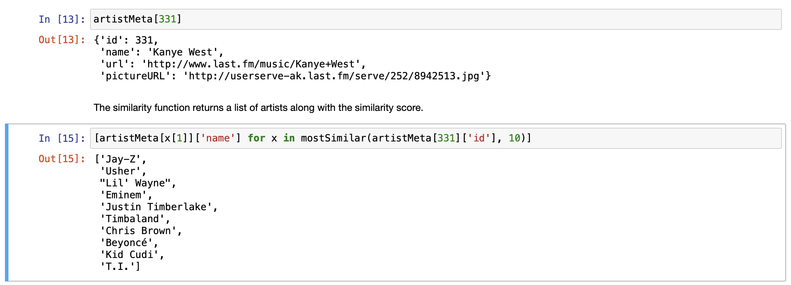

# Collaborative filtering based music recommender

Recommend similar artists based on user listening history. This project uses the [Last.fm Dataset](https://files.grouplens.org/datasets/hetrec2011/hetrec2011-lastfm-2k.zip) which contains full music listening history of 2000 Last.fm users.

## Similarity Measure
Artists are compared in similarity based on the Jaccard Similarity of the set of users who listened to those artists.

## Example
Trying to find artists similar to Kanye West results in:


## Getting Started
This project requires:
* python3
* jupyter

```bash
-> git clone https://github.com/archit-p/collaborative-filtering-music-recommender
-> cd collaborative-filtering-music-recommender
-> jupyter notebook
```

## License
This project is licensed under the MIT License. For more info see LICENSE.md.